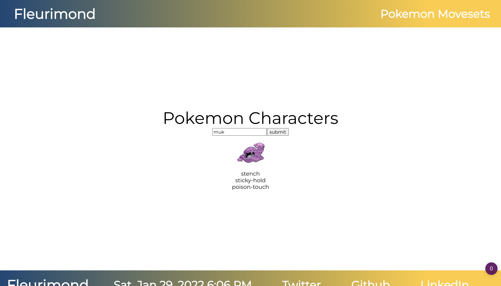

# :checkered_flag:What It Looks Like :checkered_flag:: 

# How It's Made :nut_and_bolt:🔨 :hammer::wrench::
 This application is a React + TypeScript Pokémon search app.

 # How It's Works:white_check_mark::

## My Awesome Project 
https://typescript-pokemon-api.netlify.app/

# Portfolio :open_file_folder::

** :computer:   WEBSITE:** [John Fleurimond](http://johnfleurimond.com)

# How To Get It Started :arrow_forward: :

## Installation

1. Clone repo
2. run `npm install`

## Available Scripts

In the project directory, you can run:

### `npm run build`

Builds the app for production to the `build` folder. 
It correctly bundles React in production mode and optimizes the build for the best performance.

The build is minified and the filenames include the hashes. 
Your app is ready to be deployed!

See the section about [deployment](#deployment) for more information.
### `npm run prettier`
This corrects the format.

The legacy Express/Nodemon backend and its old proxy path are no longer part of the active Pokémon application.
